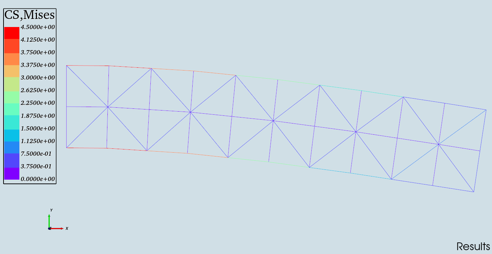
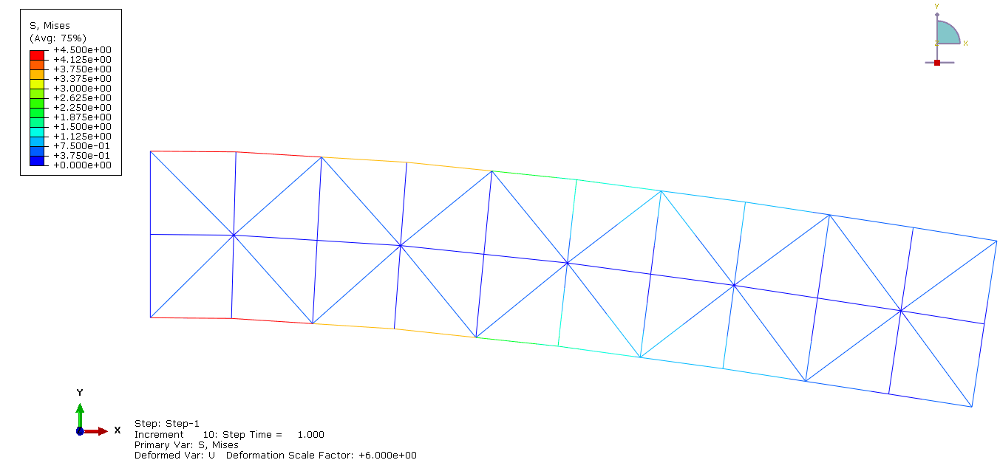
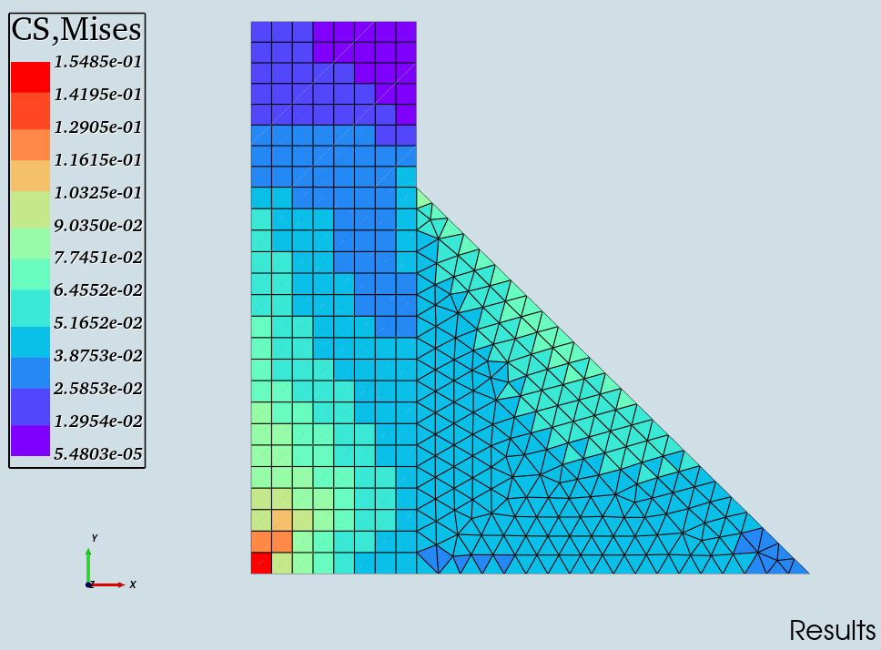
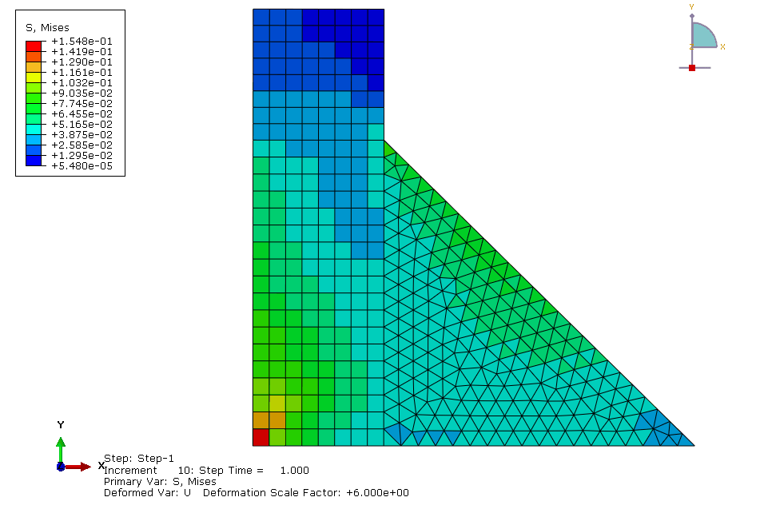
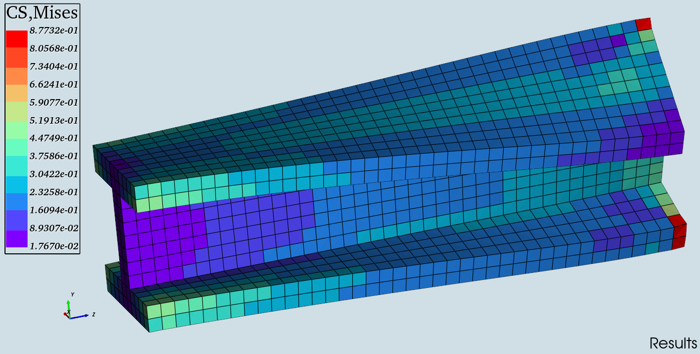
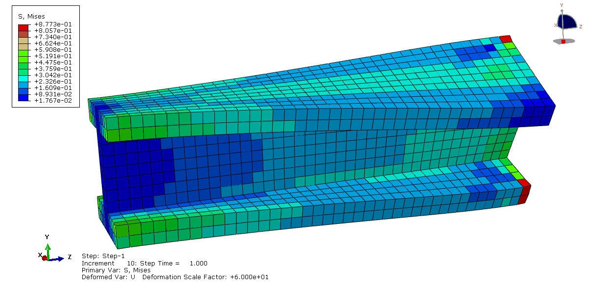

#  P4Struct —— Program for Structural Design
 [](LICENSE) [](https://www.python.org/) [](https://docs.astral.sh/uv/)
## 1. Description
## 1. Description
An **open-source** structural design software. P4Struct is built on a multi-layered architecture that couples an interactive interface with a database system, enabling efficient data management and workflow execution. Taking mesh models as input, P4Struct enables a complete design workflow encompassing **preprocessing, finite element analysis, topology optimization, and post-processing**, ultimately generating STL files ready for manufacturing.


## 2. Core functionalities

- 🎨 Modern GUI built with PySide6
- ⚡ Interactive visualization built with VTK
- 📊 Pre/post-processing workflow
- 💾 Data management with SQLite3 and H5py
- 🔬 High-precision FEA
- 🧩 Topology optimization
- 📤 STL file export


## 3. Installation

### 3.1 Source Code
Step 1: Install uv. 
```powershell
powershell -ExecutionPolicy ByPass -c "irm https://astral.sh/uv/install.ps1 | iex"
```

Step 2: Environment Setup.
```powershell
cd <your_path>
robocopy ...\<src> <your_path> /e /i
uv init -p 3.12 <your_path>
uv sync
```

Step 3:  IDE Configuration.

Step 4:  Open the "app" file and run it.

### 3.2 Executable File

Step 1: Download the compressed file 'inc.zip' and extract it to any disk that you assigned.

Step 2: Find the 'P4Struct.exe' file, create a shortcut to the desktop, and then double-click it to run (Run as administrator for the first time).

Step 3: By default, a working directory named 'P4STemp' is created in the installation package directory for storing files.  

Step 4: Finally, you can start using it (The operation video is in the "video demo" folder.).

## 4. Examples

#### 4.1 truss structure analysis
P4Struct:

Abaqus:


#### 4.2 gravity dam analysis
P4Struct:

Abaqus:


#### 4.3 torsion beam analysis
P4Struct:

Abaqus:


#### 4.4 wing rib optimization
P4Struct:


#### 4.5 cylinder optimization
P4Struct:


#### 4.6 panel optimization
P4Struct:


## 5. Contact information
This is an initial version which may contain bugs.
Please contact us promptly if you encounter any issues.
E-mail: <jihuaiwang@outlook.com>

## 6. Reference

xxxxx
